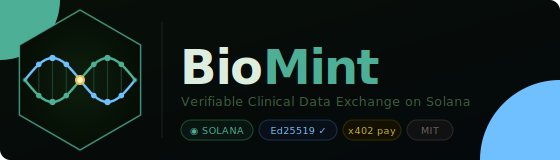

<p align="center">
  
</p>

# BioMint — Verifiable Clinical Data Exchange

> **Solana Frontier Hackathon 2026**

A decentralised micropayment hub on Solana where patients tokenise their health data and get paid automatically — only when their data provably improves a buyer's AI model. A standalone oracle agent signs every evaluation with Ed25519. No signature, no payment.

---

## The Problem

Pharmaceutical companies and AI health labs (Eli Lilly, AstraZeneca, DeepMed) need high-quality longitudinal patient data to train better models — glucose logs, genomic panels, blood biomarkers, immune profiles. Patients generate this data every day and see none of the value. Centralised data brokers (Veeva, IQVIA) intermediate, take the margin, and provide no verifiable provenance to buyers.

Solana's sub-cent fees make per-dataset micropayments viable. x402 lets a payment settle in the same HTTP round-trip as evaluation. Autonomous agents mean the entire evaluate-to-settle loop runs without human intervention.

---

## How It Works

```
Patient device        BioMint Oracle Agent       Pharma / AI buyer
 (Dexcom G7)        ──────────────────────────   (Eli Lilly)
 glucose readings ──▶ tokenize (hash only)   ──▶ evaluate dataset
 consent token    ──▶ sign result (Ed25519)  ──▶ verify oracle sig
 Solana wallet    ◀── SOL micropayment       ◀── x402 if delta > threshold
```

**Only useful data earns money.** If a dataset does not meaningfully shift the model accuracy metric, no payment fires. Junk data earns $0.

The hub **never owns patient data**. Raw readings stay on the patient's device. Only SHA-256 Merkle roots and pseudonymous HMAC-derived IDs go on-chain.

---

## Quick Start

### Run the full dashboard

```bash
npm install

# Free ports if needed, then start
lsof -ti:3000,3100 | xargs kill -9 2>/dev/null
npm run dashboard
# open http://localhost:3000
```

The dashboard server spawns the oracle agent automatically. If port 3000 is busy it will automatically try 3001, 3002, etc. — check the terminal output for the actual URL.

Click **▶ Run Session** to simulate 6 patients and 5 buyers.

### Verify it's working

```bash
# Dashboard stats
curl http://localhost:3000/api/market/stats

# Oracle agent status (should show ready: true)
curl http://localhost:3000/api/oracle/status

# Trigger a simulation via API
curl -X POST http://localhost:3000/api/market/simulate
```

### Run headless demo

```bash
npm run biomint
```

### Keep state across runs

```bash
npm run biomint:keep
```

---

## Dataset Types

| Type | Device examples | Typical value |
|---|---|---|
| `CGM_TIMESERIES` | Dexcom G7 / G6 | $0.02–$0.08 per 14-day batch |
| `LIBRE_FLASH` | FreeStyle Libre 3 | $0.01–$0.04 per session |
| `GENOME_VARIANT` | Illumina GSA / 23andMe | $0.05–$0.22 per panel |
| `LIFESTYLE_CORR` | CGM + Apple Health | $0.02–$0.06 per dataset |
| `BLOOD_BIOMARKER` | Routine blood draw | $0.03–$0.12 per panel |
| `IMMUNE_PANEL` | Flow cytometry / ELISA | $0.08–$0.40 per profile |

---

## Model Tasks

| Task | Metric | Buyers |
|---|---|---|
| `T2D_GLUCOSE_PREDICTION` | RMSE | Eli Lilly, DeepMed |
| `HYPOGLYCEMIA_ALERT` | AUROC | Eli Lilly |
| `GENOME_T2D_RISK` | AUROC | GenoCo Research |
| `DRUG_RESPONSE_TIRZEPATIDE` | AUROC | Eli Lilly |
| `INSULIN_SENSITIVITY` | RMSE | DeepMed |
| `MEAL_SPIKE_PHENOTYPING` | AUROC | DeepMed |
| `ANTIBODY_RESPONSE` | AUROC | AstraZeneca |
| `AUTOIMMUNE_RISK` | AUROC | AstraZeneca |
| `INFLAMMATION_TRAJECTORY` | RMSE | InfLab |

---

## Verifiable Compute Layer

The oracle agent (`src/oracleAgent.js`) is a standalone autonomous process:

- Generates its own **Ed25519 keypair** on first start (`data/keys/oracle_*.pem`)
- Exposes `POST /evaluate` — runs the model delta computation and **signs the result**
- The dashboard server calls `crypto.verify()` against the oracle's public key before any payment settles
- If verification fails → status is `UNVERIFIED`, payment is blocked
- The oracle pubkey is displayed live in the dashboard header

```bash
npm run oracle   # run oracle agent standalone on port 3100
```

---

## Privacy Design

| Mechanism | Detail |
|---|---|
| No PII on-chain | Only SHA-256 Merkle roots of anonymised readings |
| Consent tokens | HMAC-signed, patient-held, expire in 365 days |
| Pseudonymous IDs | `HMAC(consent_token)` → irreversible contributor ID |
| Time-shifted records | Timestamps offset ±12 h per patient to prevent calendar correlation |
| ZK commitments | `generateDataCommitment()` → (commitment, blindingFactor) for selective disclosure |

---

## On-Chain Settlement

Anchor program (`programs/data-market/src/lib.rs`) stores `DatasetRecord` PDAs derived from `["dataset", contributor_pubkey, content_hash]`. Settlement requires **two signers**: the buyer (transfers SOL) and the BioMint oracle (attests the delta). Neither party can fabricate a payment alone.

```rust
pub fn settle_improvement(
    ctx: Context<SettleImprovement>,
    delta_bps: u32,
    payment_lamports: u64,
) -> Result<()>
```

Program ID: `BMint1111111111111111111111111111111111111111` (devnet)

---

## Architecture

```
src/
  oracleAgent.js     Standalone oracle — Ed25519 signing, model evaluation
  dataMarket.js      Market lifecycle — list, evaluate, settle, ledger
  clinicalData.js    Dataset tokenization, quality gates, 6 types
  modelOracle.js     Improvement scoring, 9 model tasks, payment formula
  privacyLayer.js    Consent tokens, PII scrubbing, ZK hash commitments
  demoClinical.js    End-to-end demo — 6 patients, 5 buyers
  serve.js           Dashboard HTTP server + oracle agent lifecycle manager
  attestation.js     Ed25519 key management, signed decision records

programs/
  data-market/       Anchor program — DatasetRecord PDA, settle_improvement
  policy-registry/   Stablecoin policy registry (original Mint Guard engine)

public/
  dashboard.html     Judge-facing single-file dashboard

data/
  .gitkeep           Placeholder — runtime state files are gitignored
```

---

## Stack

- **Solana** — on-chain settlement, Anchor PDAs, devnet
- **x402** — HTTP 402 micropayment protocol for per-dataset SOL transfers
- **Node.js ESM** — dashboard server, oracle agent, market engine
- **Ed25519** (Node.js `crypto`) — oracle evaluation signatures
- **Anchor / cargo-build-sbf** — Rust on-chain program
- **HMAC-SHA256** — consent tokens, pseudonymous IDs
- **NDJSON** — append-only tamper-evident event ledger

---

## License

MIT — see [LICENSE](LICENSE)

---

<!-- original build plan and internal notes: see hackathon_notes.sh and demo_script.sh (both gitignored) -->
